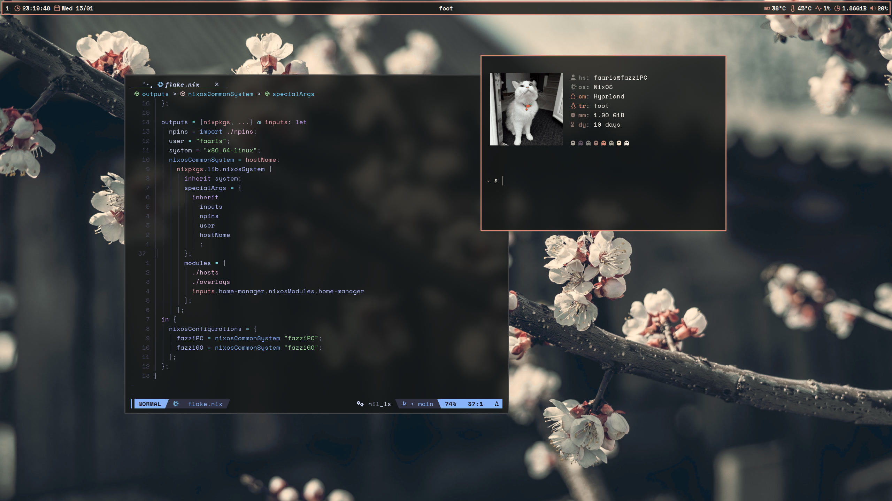
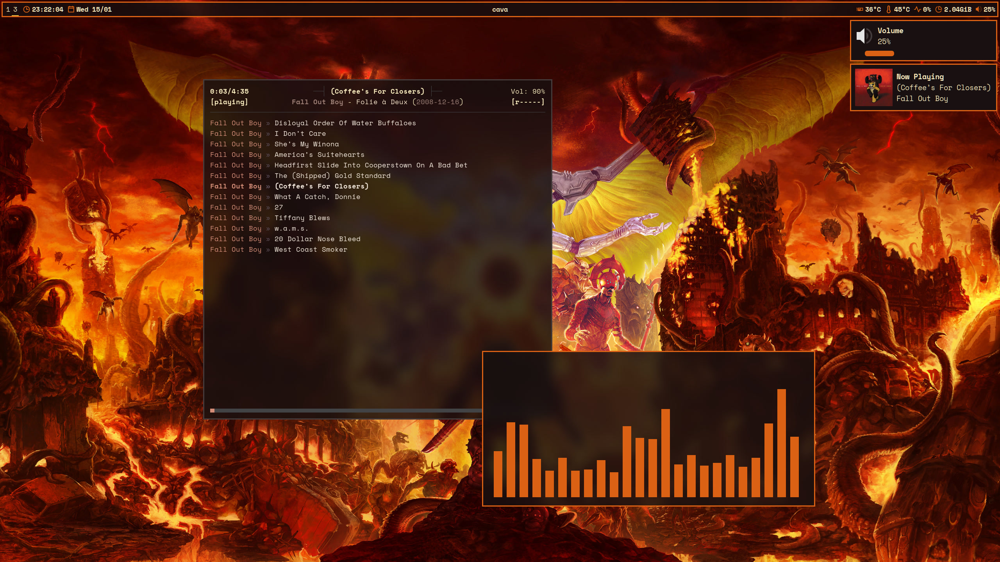

# NixOhEss - 🇵🇸

  
  

## Overview

This repo consists of a relatively simple configuration for my desktop and
laptop with nixOS and home-manager.

two hostnames will be found in my config; fazziPC and fazziGO for my PC and
laptop respectively.

**DISCLAIMER!!** There is no guarantee that these configs will work for you.
These are merely my personal configurations and they do NOT come with a
warranty.

## Structure

- [`flake.nix`](./flake.nix): The flake which declares entry points and inputs
  for my entire configuration. Basic options like the username can be found
  here.
- [`hosts/`](./hosts/): All of the nixOS configuration is contained here.
  - [`fazziPC.nix`](./hosts/fazziPC.nix): define host options for my PC
  - [`fazziGO.nix`](./hosts/fazziGO.nix): define host options for my laptop
- [`home/`](./home/): All of the home-manager configuration is contained here.
  - [`fazziPC.nix`](./home/fazziPC.nix): define home-manager options for my PC
  - [`fazziGO.nix`](./home/fazziGO.nix): define home-manager options for my
    laptop

## SPECIAL THANKS

- [raf](https://github.com/NotAShelf) for nvf and helping with a lot of stuff
- [Nobbz](https://github.com/NobbZ) for helping a ton over discord
- the others which i wasn't able to mention here!!

## License

This project is licensed under the MIT License. You are free to read the terms
of the license here: [LICENSE](./LICENSE)
