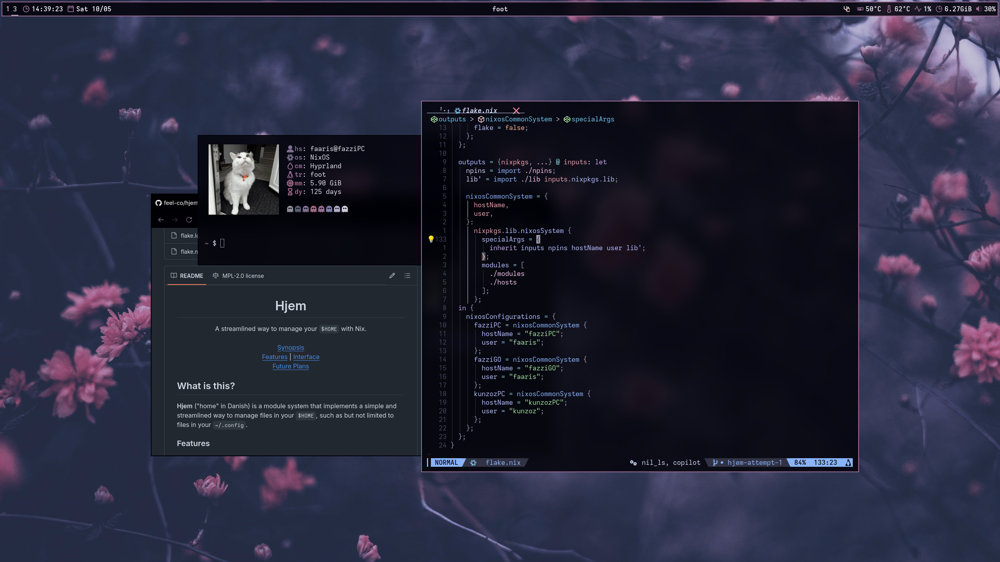

# 🇵🇸 NixOhEss 🇵🇸

## Overview

This repo consists of a relatively simple multi-host configuration using nixOS
and [hjem](https://github.com/feel-co/hjem).

> [!WARNING]
> These configurations are highly tailored to my personal setup and may not work
> out of the box for your system. They include host-specific settings such as
> hardware configurations, networking details, and secrets that **will likely
> require significant adjustments**. Use them as a reference and at your own
> risk — **no warranty is provided**.

## Hosts

- [fazziPC](./hosts/fazziPC): My main desktop PC, running an AMD 5600x and an
  RTX 3070.
- [fazziGO](./hosts/fazziGO): My Thinkpad L14 Gen 4, which sports an AMD Ryzen 5
  7530U.
- [kunzozPC](./hosts/kunzozPC): My friends gaming PC, where I manage his NixOS
  installation.

## Structure

- [`flake.nix`](./flake.nix): The flake which declares entry points and inputs
  for my entire configuration.
- [`modules/`](./modules/): This contains all host-agnostic modules which I use
  across all devices. A lot of the modules are optional, and can be configured
  in the host specific config.
- [`hosts/`](./hosts/): The configurations for each host is contained here. This
  is where the hardware configurations and host-specific modules are kept.

## SPECIAL THANKS

- [raf](https://github.com/NotAShelf) for creating nvf, my current editor of
  choice, among other projects like watt (power management) and rags (maintained
  agsv1 fork)
- [Nobbz](https://github.com/NobbZ) for providing lots of support in the nixos
  community discord server
- [feel-co](https://github.com/feel-co) for making hjem and maintaining such a
  minimal but powerful piece of software
- [nezia](https://github.com/nezia1) for helping with making hjem easy
- the others which i wasn't able to mention here!!

## License

This project is licensed under the MIT License. You are free to read the terms
of the license here: [LICENSE](./LICENSE)

I'm happy for others to benefit from my config, but give credit where credit is
due :)
