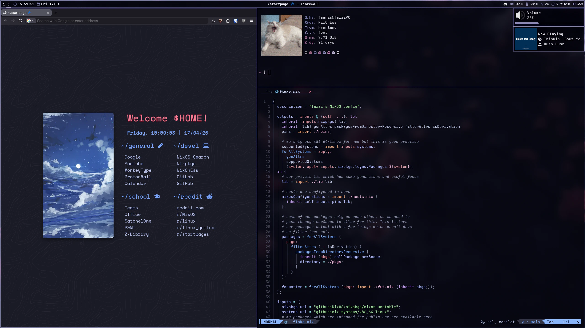

# 🇵🇸 NixOhEss 🇵🇸

## Overview

This repo consists of a relatively simple multi-host configuration using NixOS
and [hjem](https://github.com/feel-co/hjem).

> [!WARNING]
> My configurations will likely not work out of the box on other devices, due to
> the use of secrets and differing hardware to name a few issues. This repo can
> still be used as an educational resource though :)

## Hosts

- [fazziPC](./hosts/fazziPC): My main desktop PC, running an AMD 5600x and an
  RTX 3070.
- [fazziGO](./hosts/fazziGO): My Thinkpad L14 Gen 4, which sports an AMD Ryzen 5
  7530U.
- [kunzozPC](./hosts/kunzozPC): My friend's gaming PC, where I manage his NixOS
  installation.

## Structure

This flake (accidentally) makes use of the
[synaptic standard.](https://github.com/llakala/synaptic-standard)

- [`flake.nix`](./flake.nix): The entrypoint to the flake. Flake outputs are
  defined here.
- [`modules/`](./modules/): All host-agnostic modules are here and can be used
  across all hosts. A lot of the modules are optional, and can be configured in
  the host specific config.
- [`hosts/`](./hosts/): Hardware configurations and host-specific modules are
  kept here.
- [`pkgs/`](./pkgs/): Packages which are used internally in the flake (small
  scripts etc.) are located here. For packages which are intended for use
  outside of my flake, check out [azzipkgs](https://gitlab.com/fazzi/azzipkgs).
- [`lib/`](./lib/): Internal lib, providing some useful functions and
  generators.

## SPECIAL THANKS

- [raf](https://github.com/NotAShelf) for creating lots of cool software like
  [nvf](https://github.com/NotAShelf/nvf),
  [watt](https://github.com/NotAShelf/watt),
  [stash](https://github.com/NotAShelf/stash) and
  [rags](https://github.com/NotAShelf/rags)
- [feel-co](https://github.com/feel-co) for making hjem
- [nezia](https://github.com/nezia1) for persuading me to use hjem
- [Rexie](https://github.com/Rexcrazy804/Zaphkiel) for helping with npins :)
- the others which i wasn't able to mention here!!

## License

This project is licensed under the MIT License. You are free to read the terms
of the license here: [LICENSE](./LICENSE)

I'm happy for others to benefit from my config, but give credit where credit is
due :)
