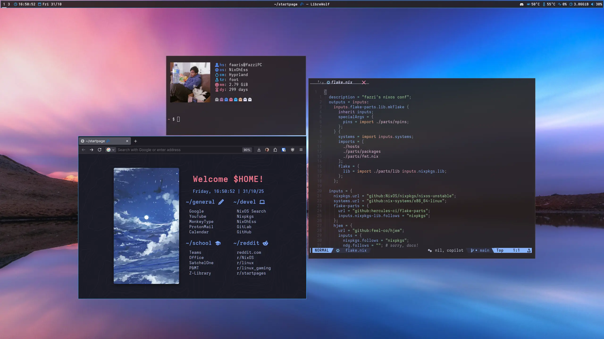

# 🇵🇸 NixOhEss 🇵🇸



## Overview

This repo consists of a relatively simple multi-host configuration using NixOS
and [hjem](https://github.com/feel-co/hjem). [flake-parts](https://flake.parts/)
is also used to modularize the flake.

> [!WARNING]
> My configurations will likely not work OOTB on other devices, due to the use
> of secrets, different hardware, among other things. Tread with caution!

## Hosts

- [fazziPC](./hosts/fazziPC): My main desktop PC, running an AMD 5600x and an
  RTX 3070.
- [fazziGO](./hosts/fazziGO): My Thinkpad L14 Gen 4, which sports an AMD Ryzen 5
  7530U.
- [kunzozPC](./hosts/kunzozPC): My friend's gaming PC, where I manage his NixOS
  installation.

## Packages

All available packages are listed [here.](./parts/pkgs/packages/)

It's easy to use packages from my flake if you want! Simply add my repo to your
`flake.nix`, and make my local nixpkgs version follow yours:

```nix
nixohess = {
  url = "gitlab:fazzi/nixohess";
  inputs.nixpkgs.follows = "nixpkgs";
};
```

and then my packages are available in your flake. To use `stremio-linux-shell`
for example, add

```nix
inputs.nixohess.packages.${pkgs.stdenv.hostPlatform.system}.stremio-linux-shell
```

to your `environment.systemPackages`.

## Structure

- [`flake.nix`](./flake.nix): The entrypoint to each module of my flake, using
  flake-parts.
- [`parts/`](./parts/): My larger flake decomposed into smaller parts.
- [`modules/`](./modules/): This contains all host-agnostic modules which I use
  across all devices. A lot of the modules are optional, and can be configured
  in the host specific config. All module files are imported automatically under
  `self.nixosModules.default`.
- [`hosts/`](./hosts/): The configurations for each host is contained here. This
  is where the hardware configurations and host-specific modules are kept.

## SPECIAL THANKS

- [raf](https://github.com/NotAShelf) for creating lots of cool software like
  [nvf](https://github.com/NotAShelf/nvf),
  [watt](https://github.com/NotAShelf/watt),
  [stash](https://github.com/NotAShelf/stash) and
  [rags](https://github.com/NotAShelf/rags)
- [feel-co](https://github.com/feel-co) for making hjem
- [nezia](https://github.com/nezia1) for persuading me to use hjem
- [Rexie](https://github.com/Rexcrazy804/Zaphkiel) for helping with npins :)
- [NobbZ](https://github.com/NobbZ) for providing support when i was a beginner
- the others which i wasn't able to mention here!!

## License

This project is licensed under the MIT License. You are free to read the terms
of the license here: [LICENSE](./LICENSE)

I'm happy for others to benefit from my config, but give credit where credit is
due :)
